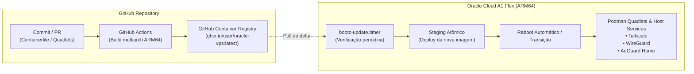

# 🚀 Oracle Cloud A1.Flex — GitOps OS com bootc / BlueBuild

Infraestrutura como Código (IaC) e GitOps para uma VPS Oracle Cloud Infrastructure (OCI) `VM.Standard.A1.Flex` (ARM64 / aarch64), utilizando uma imagem de sistema operacional conteinerizada e imutável (paradigma **bootc** / **BlueBuild**), com compilação automatizada via **GitHub Actions**, publicação no **GitHub Container Registry (GHCR)** e auto-atualização contínua na VPS.

---

## 📋 Sumário
1. [Visão Geral e Arquitetura](#-visão-geral-e-arquitetura)
2. [Comparativo: Alpine Linux vs. Fedora bootc / BlueBuild](#-comparativo-alpine-linux-vs-fedora-bootc--bluebuild)
3. [Especificações do Ambiente Oracle Cloud](#-especificações-do-ambiente-oracle-cloud)
4. [Stack de Serviços](#-stack-de-serviços)
5. [Estrutura do Repositório](#-estrutura-do-repositório)
6. [Fluxo GitOps de Atualização Automática](#-fluxo-gitops-de-atualização-automática)
7. [Guia de Implementação e Provisionamento Passo a Passo](#-guia-de-implementação-e-provisionamento-passo-a-passo)
8. [Configurações dos Serviços (Quadlets & Networking)](#-configurações-dos-serviços-quadlets--networking)

---

## 🧠 Visão Geral e Arquitetura

O objetivo é replicar no servidor a experiência do **Fedora Kinoite / Silverblue** aliada ao **BlueBuild**:
- O sistema operacional inteiro é definido em um **`Containerfile`** (ou `recipe.yml` do BlueBuild).
- Cada alteração (pacote instalado, sysctl de rede, arquivo de serviço) é versionada no Git.
- O **GitHub Actions** compila a imagem nativamente para `linux/arm64` e envia para o **GHCR**.
- A VPS (OCI A1.Flex) verifica novas tags/shas via serviço `bootc-update.timer`, aplica as camadas em staging e reinicia de forma atômica e segura.



---

## ⚖️ Comparativo: Alpine Linux vs. Fedora bootc / BlueBuild

Atualmente você utiliza **Alpine Linux**. Veja uma análise honesta comparando ambos para o seu caso de uso:

| Critério | Alpine Linux | Fedora bootc / BlueBuild | Veredito para o seu caso |
| :--- | :--- | :--- | :--- |
| **Consumo de Memória (RAM em Idle)** | **~40 MB a 80 MB** (imbatível em leveza) | **~350 MB a 550 MB** | Com **24 GB** na Oracle A1, 500 MB representam apenas **2% da RAM**. A economia extrema do Alpine perde peso diante dos 24 GB livres. |
| **Ciclo de Vida da Imagem (GitOps)** | Manual/Complexo. Requer `alpine-make-vm-image`, scripts de `lbu` (diskless) ou Ansible/cloud-init após o boot. | **Nativo OCI**. Um simples `Containerfile` define todo o SO. Atualizações atômicas prontas de fábrica. | **Vencedor: bootc**. É exatamente o fluxo do BlueBuild/Kinoite que você procura. |
| **Rollback e Confiabilidade** | Se um `apk upgrade` quebrar a rede/kernel, exige acesso ao console VNC da Oracle. | **Rollback automático via GRUB/ostree**. Se a nova imagem falhar, a anterior continua intacta. | **Vencedor: bootc**. Segurança crítica para servidores remotos na nuvem. |
| **Containers & Systemd (Quadlets)** | Usa **OpenRC**. O Podman funciona, mas não há integração nativa com Quadlets (que dependem do systemd). | **Systemd + Podman Quadlet nativo**. Containers rodam como unit files declarativos no `/etc/containers/systemd/`. | **Vencedor: bootc**. Muito mais fácil orquestrar Tailscale, Wireguard e Adguard. |
| **Compatibilidade de Binários (libc)** | `musl libc`. Geralmente ok para Go/Rust, mas pode exigir flags especiais ou emulação glibc (`gcompat`). | `glibc` padrão de mercado e kernel Linux moderno com drivers upstream aarch64. | **Vencedor: bootc**. Zero fricção de compatibilidade. |
| **Tempo de Build no GitHub Actions** | Rápido para scripts, mas criar imagens de disco `.qcow2` é custoso. | Rápido com Docker/Podman buildx e cache de camadas OCI. | **Vencedor: bootc**. |

### Conclusão do Comparativo
O **Alpine Linux** continua sendo a melhor escolha para instâncias mínimas (ex: VPS x86 de 512 MB a 1 GB de RAM). No entanto, para a instância **Oracle A1.Flex (4 vCPU ARM64, 24 GB RAM)**, o **Fedora bootc / BlueBuild** é muito superior: transforma a VPS num eletrodoméstico imutável, elimina o medo de quebrar o sistema em upgrades de rede/VPN e traz suporte nativo a Quadlets com systemd.

---

## ☁️ Especificações do Ambiente Oracle Cloud

A instância **VM.Standard.A1.Flex** (Ampere Altra ARM64) no nível Always Free da Oracle oferece:
- **Processador:** 1 a 4 OCPUs (arquitetura ARM Neoverse N1, 64-bit aarch64).
- **Memória:** Até 24 GB de RAM.
- **Armazenamento:** Até 200 GB de Volume de Inicialização (Boot Volume).
- **Firmware:** UEFI nativo.
- **Rede:** Interface VirtIO com IPv4 público e IPv6 nativo.

---

## 🛠️ Stack de Serviços

1. **Kernel / Host:**
   - Fedora bootc (tag `latest`, ARM64).
   - SELinux ativo em modo Enforcing.
   - Forwarding de pacotes IP e sysctls otimizados para VPN.
2. **Conectividade & Rede:**
   - **Tailscale:** Integrado no host ou via container com `/dev/net/tun`.
   - **WireGuard:** Módulo de kernel nativo com `wireguard-tools`.
3. **DNS & Bloqueio:**
   - **AdGuard Home:** Rodando via Podman Quadlet com portas 53 (DNS), 80/443 (Painel/DoH) mapeadas.
4. **Gerenciamento de Containers:**
   - **Podman + Quadlet:** Arquivos declarativos `.container` em `/etc/containers/systemd/`.
   - **Auto-Update de Containers:** `podman-auto-update.timer`.

---

## 📁 Estrutura do Repositório

```text
oracle-vps/
├── .github/
│   └── workflows/
│       └── build.yml               # Pipeline GitHub Actions (Build & Push no GHCR)
├── config/
│   ├── containers/                 # Podman Quadlets (Systemd)
│   │   ├── adguardhome.container   # Serviço do AdGuard Home
│   │   └── tailscale.container     # Serviço do Tailscale (ou instalado no host)
│   ├── network/
│   │   └── 99-ip-forward.conf      # Sysctl para roteamento VPN
│   └── systemd/
│       └── bootc-update.timer      # Timer para atualização automática do SO
├── Containerfile                   # Definição imutável do Sistema Operacional
├── README.md                       # Documentação do projeto
└── recipe.yaml                     # Alternativa caso opte pela CLI do BlueBuild
```

---

## 🔄 Fluxo GitOps de Atualização Automática

1. **Edição:** Você edita qualquer arquivo neste repositório (ex: adiciona um pacote no `Containerfile` ou altera um Quadlet).
2. **Build:** O GitHub Actions dispara o workflow, compila a imagem para `linux/arm64` e envia para `ghcr.io/<seu-usuario>/oracle-vps:latest`.
3. **Verificação:** Na VPS, o `bootc-update.timer` executa periodicamente:
   ```bash
   bootc update
   ```
4. **Staging & Reboot:** O bootc faz o download das novas camadas OCI em segundo plano. Uma nova entrada no GRUB/BLS é criada. No próximo reboot (automático ou agendado de madrugada), a VPS inicializa no novo estado.
5. **Rollback Seguro:** Se algo falhar na inicialização, o systemd/bootc pode reverter para o deployment anterior. Manualmente, basta rodar `bootc rollback`.

---

## 🚀 Guia de Implementação e Provisionamento Passo a Passo

### Passo 1: Configurar o Repositório no GitHub
1. Crie o repositório no GitHub (ex: `oracle-vps`).
2. Garanta que o GitHub Actions tenha permissão de escrita em Packages (`Settings` -> `Actions` -> `General` -> `Workflow permissions` -> `Read and write permissions`).
3. Ao gerar a imagem pública no GHCR, altere a visibilidade do pacote para **Public** (ou configure autenticação privada na VPS via `/etc/ostree/auth.json`).

### Passo 2: Criar a VM na Oracle Cloud
1. Acesse o Console OCI -> **Compute** -> **Instances** -> **Create Instance**.
2. **Image:** Escolha **Fedora** (se disponível na lista de imagens de parceiros) ou **CentOS Stream 9 / Oracle Linux 9 (aarch64)**.
3. **Shape:** `VM.Standard.A1.Flex` -> configure 4 OCPUs e 24 GB de RAM.
4. **Boot Volume:** Defina de 50 GB a 200 GB.
5. Adicione sua chave SSH pública.

### Passo 3: Migrar a Instância Existente para o seu `bootc`
Se você inicializou com Fedora padrão na VM da Oracle, a migração para a sua imagem conteinerizada personalizada é feita em apenas um comando:

```bash
# Na VPS Oracle via SSH:
sudo bootc switch ghcr.io/<seu-usuario>/oracle-vps:latest

# Reinicie para carregar o novo sistema imutável:
sudo reboot
```

> **Dica:** Caso a imagem base da Oracle não tenha o binário `bootc`, instale-o via `dnf install -y bootc podman` antes de rodar o comando acima.

---

## 🧩 Configurações dos Serviços (Quadlets & Networking)

### 1. Roteamento IP (VPN / WireGuard / Tailscale)
Arquivo: `config/network/99-ip-forward.conf`
```ini
net.ipv4.ip_forward = 1
net.ipv6.conf.all.forwarding = 1
net.core.default_qdisc = fq
net.ipv4.tcp_congestion_control = bbr
```

### 2. AdGuard Home como Quadlet
Arquivo: `config/containers/adguardhome.container`
```ini
[Unit]
Description=AdGuard Home DNS Server
After=network-online.target

[Container]
Image=docker.io/adguard/adguardhome:latest
AutoUpdate=registry
Network=host
Volume=/var/lib/adguardhome/work:/opt/adguardhome/work:Z
Volume=/var/lib/adguardhome/conf:/opt/adguardhome/conf:Z

[Install]
WantedBy=multi-user.target
```

### 3. Atualização Automática do SO (bootc)
Arquivo: `config/systemd/bootc-update.timer`
```ini
[Unit]
Description=Verificação periódica de nova imagem do SO
After=network-online.target

[Timer]
OnBootSec=10min
OnUnitActiveSec=6h
Persistent=true

[Install]
WantedBy=timers.target
```

Serviço correspondente: `config/systemd/bootc-update.service`
```ini
[Unit]
Description=Atualizar imagem do SO via bootc
Wants=network-online.target
After=network-online.target

[Service]
Type=oneshot
ExecStart=/usr/bin/bootc update --apply
```
*(A flag `--apply` reinicia a máquina automaticamente se houver nova versão).*

