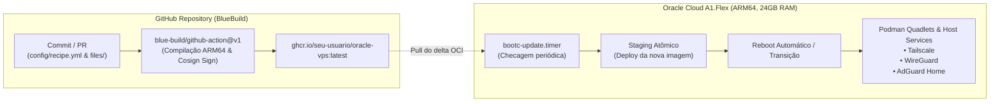

# 🚀 Oracle Cloud A1.Flex — GitOps OS com Framework BlueBuild & bootc

Infraestrutura como Código (IaC) e GitOps para uma VPS Oracle Cloud Infrastructure (OCI) `VM.Standard.A1.Flex` (ARM64 / aarch64), utilizando uma imagem de sistema operacional conteinerizada e imutável baseada no framework **[BlueBuild](https://blue-build.org)** e **[bootc](https://containers.github.io/bootc/)**, com compilação automatizada via **GitHub Actions** (`blue-build/github-action@v1`), assinatura criptográfica com **Cosign/Sigstore**, publicação no **GitHub Container Registry (GHCR)** e auto-atualização contínua na VPS.

---

## 📋 Sumário
1. [Visão Geral e Arquitetura](#-visão-geral-e-arquitetura)
2. [Comparativo: Alpine Linux vs. Fedora bootc / BlueBuild](#-comparativo-alpine-linux-vs-fedora-bootc--bluebuild)
3. [Especificações do Ambiente Oracle Cloud](#-especificações-do-ambiente-oracle-cloud)
4. [Stack de Serviços](#-stack-de-serviços)
5. [Estrutura do Repositório (Padrão BlueBuild)](#-estrutura-do-repositório-padrão-bluebuild)
6. [Fluxo GitOps de Atualização Automática](#-fluxo-gitops-de-atualização-automática)
7. [Guia de Implementação e Provisionamento Passo a Passo](#-guia-de-implementação-e-provisionamento-passo-a-passo)
8. [Configurações dos Serviços (Quadlets & Networking)](#-configurações-dos-serviços-quadlets--networking)

---

## 🧠 Visão Geral e Arquitetura

O objetivo é trazer o paradigma declarativo e reprodutível do **Fedora Kinoite** diretamente para o servidor com o **BlueBuild**:
- O sistema operacional inteiro é configurado em **`config/recipe.yml`**.
- Arquivos de configuração do sistema e unit files ficam no diretório **`config/files/`**, sendo injetados automaticamente na raiz (`/`) da imagem pelo módulo `files`.
- O workflow do GitHub Actions executa a action oficial **`blue-build/github-action@v1`**, que compila a imagem para `linux/arm64`, assina com **Cosign** e publica no **GHCR**.
- A VPS (OCI A1.Flex) roda o `bootc-update.timer`, puxa as novas camadas em staging atômico e reinicia no novo estado.



---

## ⚖️ Comparativo: Alpine Linux vs. Fedora bootc / BlueBuild

Atualmente você utiliza **Alpine Linux**. Veja uma análise honesta comparando ambos para o seu caso de uso:

| Critério | Alpine Linux | Fedora bootc / BlueBuild | Veredito para o seu caso |
| :--- | :--- | :--- | :--- |
| **Consumo de Memória (RAM em Idle)** | **~40 MB a 80 MB** (imbatível em leveza) | **~350 MB a 550 MB** | Com **24 GB** na Oracle A1, 500 MB representam apenas **~2% da RAM**. A economia extrema do Alpine perde relevância prática diante de 24 GB livres. |
| **Ciclo de Vida da Imagem (GitOps)** | Manual/Complexo. Requer `alpine-make-vm-image`, scripts de `lbu` (diskless) ou Ansible pós-boot. | **Nativo OCI com BlueBuild**. Um simples `recipe.yml` com módulos cuida de tudo declarativamente. | **Vencedor: BlueBuild**. É exatamente o fluxo do Kinoite que você procura. |
| **Rollback e Confiabilidade** | Se um `apk upgrade` quebrar a rede/kernel, exige acesso ao console VNC da Oracle. | **Rollback automático via GRUB/ostree**. Se a nova imagem falhar, a anterior continua intacta. | **Vencedor: BlueBuild/bootc**. Segurança crítica para servidores remotos na nuvem. |
| **Containers & Systemd (Quadlets)** | Usa **OpenRC**. O Podman funciona, mas não há integração nativa com Quadlets (que dependem do systemd). | **Systemd + Podman Quadlet nativo**. Containers rodam como unit files declarativos em `/etc/containers/systemd/`. | **Vencedor: BlueBuild/bootc**. Muito mais fácil orquestrar Tailscale, Wireguard e Adguard. |
| **Compatibilidade de Binários (libc)** | `musl libc`. Geralmente ok para Go/Rust, mas pode exigir flags especiais ou emulação glibc (`gcompat`). | `glibc` padrão de mercado e kernel Linux moderno com drivers upstream aarch64. | **Vencedor: BlueBuild/bootc**. Zero atrito de compatibilidade. |
| **Assinatura e Segurança da Imagem** | Processo manual. | **Assinatura nativa com Cosign/Sigstore** via BlueBuild. | **Vencedor: BlueBuild**. |

---

## ☁️ Especificações do Ambiente Oracle Cloud

A instância **VM.Standard.A1.Flex** (Ampere Altra ARM64) no nível Always Free da Oracle oferece:
- **Processador:** 1 a 4 OCPUs (arquitetura ARM Neoverse N1, 64-bit aarch64).
- **Memória:** Até 24 GB de RAM.
- **Armazenamento:** Até 200 GB de Volume de Inicialização (Boot Volume).
- **Firmware:** UEFI nativo.
- **Rede:** Interface VirtIO com IPv4 público e IPv6 nativo.

---

## 🛠️ Stack de Serviços

1. **Kernel / Host:**
   - Base: `quay.io/fedora/fedora-bootc:latest` (ARM64).
   - SELinux ativo em modo Enforcing.
   - Forwarding de pacotes IP e BBR ativados para VPNs.
2. **Conectividade & Rede:**
   - **Tailscale:** Integrado no host (`tailscaled.service`).
   - **WireGuard:** Módulo de kernel nativo com `wireguard-tools`.
3. **DNS & Bloqueio:**
   - **AdGuard Home:** Rodando via Podman Quadlet declarativo com persistência em `/var/lib/adguardhome/`.
4. **Gerenciamento de Containers:**
   - **Podman + Quadlet:** Arquivos `.container` em `/etc/containers/systemd/`.
   - **Auto-Update de Containers:** `podman-auto-update.timer`.

---

## 📁 Estrutura do Repositório (Padrão BlueBuild)

O repositório segue a estrutura padrão do ecossistema BlueBuild:

```text
oracle-vps/
├── .github/
│   └── workflows/
│       └── build.yml                        # Workflow chamando blue-build/github-action@v1
├── config/
│   ├── recipe.yml                           # Receita principal BlueBuild (módulos, pacotes, systemd)
│   └── files/                               # Injetado diretamente na raiz (/) da imagem
│       └── etc/
│           ├── containers/
│           │   └── systemd/
│           │       └── adguardhome.container # Quadlet do AdGuard Home
│           ├── sysctl.d/
│           │   └── 99-ip-forward.conf        # Otimizações de rede e forwarding para VPN
│           └── systemd/
│               └── system/
│                   ├── bootc-update.service  # Execução de 'bootc update --apply'
│                   └── bootc-update.timer    # Timer periódico de atualização
├── cosign.pub                               # Chave pública para validação de integridade da imagem
└── README.md                                # Documentação do projeto
```

---

## 📄 A Receita: `config/recipe.yml`

```yaml
# yaml-language-server: $schema=https://schema.blue-build.org/recipe-v1.json
name: oracle-vps
description: Imagem de servidor imutável personalizada para Oracle Cloud A1.Flex ARM64
base-image: quay.io/fedora/fedora-bootc
image-version: latest

platforms:
  - linux/arm64

modules:
  - type: files

  - type: dnf
    install:
      packages:
        - wireguard-tools
        - tailscale
        - podman
        - iptables
        - nftables
        - systemd-resolved
        - curl
        - wget
        - htop
        - nano

  - type: systemd
    system:
      enable:
        - tailscaled.service
        - podman.socket
        - podman-auto-update.timer
        - bootc-update.timer

  - type: script
    snippets:
      - mkdir -p /var/lib/adguardhome/work /var/lib/adguardhome/conf
```

---

## 🔐 Configuração do Cosign (Assinatura de Imagens)

O framework BlueBuild exige uma chave de assinatura Cosign para assinar a imagem no GHCR.

### 1. Gerar o par de chaves localmente:
```bash
# Gere a chave sem senha (pressione Enter quando solicitar senha):
cosign generate-key-pair
```
Isso criará dois arquivos:
- `cosign.key` (sua chave privada — **nunca envie para o Git!**)
- `cosign.pub` (sua chave pública — essa fica no repositório)

### 2. Configurar o segredo no GitHub:
1. Acesse o seu repositório no GitHub: **Settings** -> **Secrets and variables** -> **Actions** -> **New repository secret**.
2. Nome: `SIGNING_SECRET`
3. Valor: cole todo o conteúdo do arquivo `cosign.key`.
4. (Opcional via GitHub CLI):
   ```bash
   gh secret set SIGNING_SECRET < cosign.key
   ```

---

## 🚀 Guia de Implementação e Provisionamento Passo a Passo

### Passo 1: Configurar Permissões do Repositório no GitHub
1. No seu repositório GitHub: **Settings** -> **Actions** -> **General** -> **Workflow permissions** -> Marque **Read and write permissions**.
2. Adicione o secret `SIGNING_SECRET` gerado no passo anterior.
3. Ao gerar o primeiro pacote no GHCR, altere a visibilidade do pacote para **Public** (ou configure autenticação privada na VPS via `/etc/ostree/auth.json`).

### Passo 2: Criar a VM na Oracle Cloud
1. Acesse o Console OCI -> **Compute** -> **Instances** -> **Create Instance**.
2. **Image:** Escolha **Fedora** ou **CentOS Stream 9 / Oracle Linux 9 (aarch64)**.
3. **Shape:** `VM.Standard.A1.Flex` -> configure 4 OCPUs e 24 GB de RAM.
4. **Boot Volume:** Defina de 50 GB a 200 GB.
5. Adicione sua chave SSH pública.

### Passo 3: Migrar a Instância Existente para o seu `bootc`
Na VPS Oracle via SSH:

```bash
# Caso a imagem base não tenha o bootc instalado:
sudo dnf install -y bootc podman

# Rebase para sua imagem BlueBuild personalizada:
sudo bootc switch ghcr.io/<seu-usuario>/oracle-vps:latest

# Reinicie para carregar o sistema imutável:
sudo reboot
```

---

## 💻 Teste e Build Local com a CLI BlueBuild

Caso queira inspecionar ou validar a receita localmente na sua máquina (usando a CLI do BlueBuild):

```bash
# Instalar a CLI do BlueBuild (caso ainda não tenha):
# curl -fsSL https://blue-build.org/install.sh | bash

# Gerar o Containerfile equivalente a partir da receita:
bluebuild generate config/recipe.yml

# Compilar localmente (opcional):
bluebuild build config/recipe.yml
```
